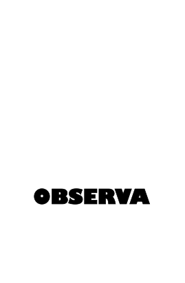
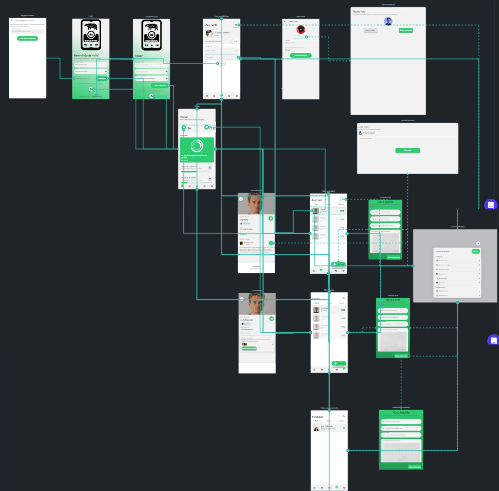
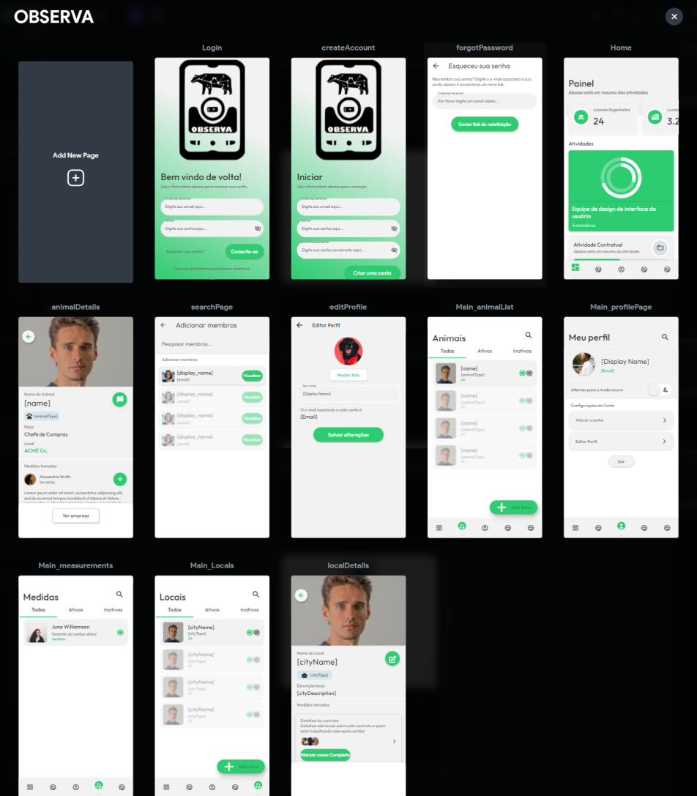
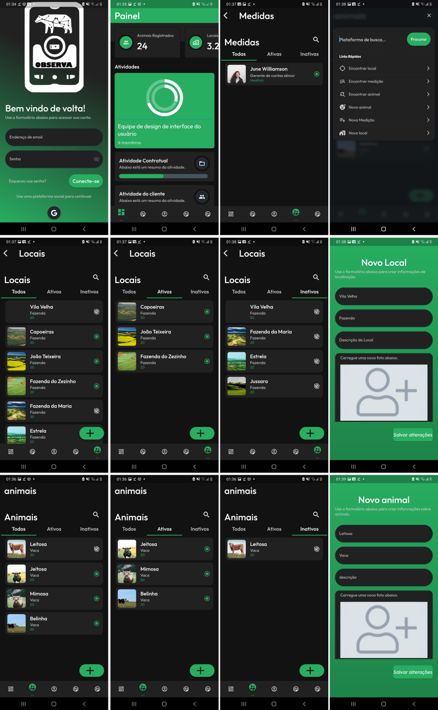

# APP OBSERVA

Projeto Disciplina PGIA 7310 - Fundamentos de Informática Aplicada UFRPE

## LOGOS APP

 

## SOBRE O APP

### Slogan
"OBSERVA: Monitore a saúde de seus animais com precisão!"

### Descrição do sistema
O OBSERVA é um sistema avançado que permite aos cuidadores de animais monitorar e registrar variáveis importantes relacionadas à saúde e bem-estar de seus animais, independentemente da espécie. Com o OBSERVA, é possível ter acesso a informações precisas sobre o desenvolvimento dos animais e tomar decisões informadas para garantir sua saúde e produtividade. 

### Justificativa do produto
Acesso a informações precisas sobre a saúde dos animais é fundamental para garantir seu bem-estar e produtividade. O OBSERVA foi desenvolvido para fornecer aos cuidadores de animais uma ferramenta confiável para monitorar a saúde de seus animais e tomar decisões informadas com base em dados precisos. 

### Público-alvo
O OBSERVA é destinado a cuidadores de animais que valorizam informações precisas sobre a saúde de seus animais e desejam tomar decisões informadas para garantir seu bem-estar e produtividade.

## MVP OBSERVA
[Link para o video de apresentação do app](https://youtu.be/ZjmerEBOoOY)

## FLUXOGRAMA

## TELAS
Abaixo estão as telas iniciais e em preview mode;
\
\
Abaixo estão as telas em modo de execução do app instalado em um mobile. 
\

## QUAIS OS COMPONENTES DO APP
Painel de login e senha; \
Painel de cadastro de conta de usuário; \
Painel de recuperação de conta de usuário; \
Painel do usuário; \
Painel de edição de dados do usuário; \
Painel de resumo de dados consolidados do app; \
Painel de cadastro de novos locais de trabalho; \
Painel de cadastro de novos animais; \
Painel de cadastro de novas medidas; 

